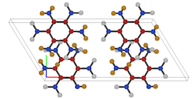

 #Crystal builder v. 3.5.0
#Crystal builder v. 3.5.0

##Capabilities

    Crystal Builder - Simple program to build several crystal structures for use in many popular 
    molecular dynamics and denisty functional theory packages.  

- Bravais lattices: Cubic, Hexagonal, Orthorhombic, Tetragonal

- Library structures: 
    - 2D materials: Graphene, h-BN, (M)etal (D)i(C)halcogenide-2H/1T (i.e. SnS2), (T)ransition (M)etal (D)i(C)halcogenide-2H/1T (i.e. MoSe2)
    - Energetic materials (PETN-I, TATB, β-HMX)

- Define a custom lattice by specifying the lattice parameters and angles, the basis positions, and the element types

- Build and view large super cells (no limit on maximum atoms)

- 3D graphics rendering of the crystals with real time user interaction

- Display as a molecule or with a periodic unit cell

- Display bonds between nearest neighbors, uniform adjustable cutoff

- Print output atomic coordinates as fractional or cartesian

- Output to several popular Denisty Functional Theory and Molecular Dynamics packages: 
    - Materials Studio DMol (.car) 
    - LAMMPS (.input) 
    - VASP 5.x.x (POSCAR)  

__________________________________________________________________________________

##GTK+-2.0 Libraries

* NOTE: If you do not have the GTK+-2.0 libraries installed and in the usual
path, i.e. `/usr/lib & /usr/include` for Linux or as a `Framework` on Mac OS X,
follow the directions below to install them.

###Linux
a) Fedora 21/RHEL 6.X/CentOS 6.X
Run the following command,

	yum install gtk+-devel gtk2-devel

a) Debian/Ubuntu
Run the following command,

	apt-get install libgtk2*

###Mac OS X
a) Install homebrew and then run the following command,

	brew install gtk2

###Windows
Not supported

__________________________________________________________________________________

##Install main application

Simply run the following command in the top-level directory,

	make 

Alternatively, type the following to see a list of options available to `make`,

    make help

Once complete, the executable will be placed in the `build/` directory
located in the top-level of this distribution.

__________________________________________________________________________________

##Usage
To see extensive documentation on the contents and how to use the code, navigate to the toplevel of this directory to the `docs/html/` directory and open the file called `index.html`.

To use the program, simply execute the following in a terminal,
	
	./crysb  

Currently, three options are available for using this application:

1) Define all the relevant parameters in the `Lattice`, `Modify`, and `Output` tabs

    To begin, select one of the crystals from the drop down and fill in the relevant parameters
    presented in the pop-up menu.  Then nvaigate to the modify tab to define a chemical element. 
    If you wish to create a supercell, then fill in any of the three empty boxes.  By default, 
    these are set to 1x1x1, and so any of can of them be left empty.  To finish, navigate to the 
    `Output` tab, and select a format from the dropdown. If choosing the `LAMMPS` or `DMol` 
    format, then you must specify a file name, using the `Save as` button, for the `VASP` format, 
    this is unnecessary since the file written is named `POSCAR`.

2) Select a library structure from the dropdown in the `Lattice` tab.

    To begin, select `Library` from the `Crystals` dropdown menu.  If building one of hte 2D 
    materials, some interaction may be necessary.  In the case of graphene, the `a` lattice 
    parameter is required.  For the layered (T)MDC structures, the default is to use MoS2, and 
    a lattice parameters of 3.19 Å for all four cases.  If you wish to build a different crystal, 
    then define the stoichiometry on the bottom of the `Modify` tab.  The syntax for defining the 
    stoichiometry is the following:

          Type1:n1,Type2:n2 i.e.  Mo:1,S:2 or  Sn:1,Se:2.

    If you wish to create a supercell, then fill in any of the three empty boxes.  By default, 
    these are set to 1x1x1, and so any of can of them be left empty.  To finish, navigate to the 
    `Output` tab, and select a format from the dropdown. If choosing the `LAMMPS` or `DMol` format, 
    then you must specify a file name, using the `Save as` button, for the `VASP` format, this is 
    unnecessary since the file written is named `POSCAR`.

3) Define a custom crystal with the `Custom crystal` button

    To build a custom crystal, click the `Custom crystal` button in the `Lattice` tab.  A pop-up 
    menu containing entries for the pertinant data will appear. In this scenario, a,b,c and  α,β,γ,
    the stoichiometry and the basis have no defaults and must be explictly defined.  For the 
    stoichiometry, the syntax is the as above,

        Type1:n1,Type2:n2,Type3:n3,... i.e.  C:3 or Mo:1,S:2 or  C:10,H:16,N:8,O:24.    

    Once the lattice paramters, angles and stoichiometry are defined, click the `Add atom` button 
    to begin defining the basis.  To define the coordinates, use the fractional system and enter 
    them as a comma separated field, i.e. (0.5, 0.25, 0).  To save the coordinates, hit the enter 
    button after all three coordinates are defined.  If a mistake is made, hit the `Reset` button 
    below this entry field.  This will reset only the basis atoms entered so far, and nothing else. 

    ** NOTE The order of atoms added is relevant here and should follow the 
            stoichiometric relationship defined above.

    If you wish to create a supercell, then fill in any of the three empty boxes.  By default, these 
    are set to 1x1x1, and so any of can of them be left empty.  To finish, navigate to the `Output` 
    tab, and select a format from the dropdown. If choosing the `LAMMPS` or `DMol` format, then you 
    must specify a file name, using the `Save as` button, for the `VASP` format, this is unnecessary 
    since the file written is named `POSCAR`.

Once the crystal has been defined and other relevant parameters are set, you can chose to simply build the crystal and have it saved to your file.

Alternatively, if the `Open GL` library was used in building this application, the crystal can be viewed in an interactive window by clicking the `Build+render` tab, see below for keyboard and mouse commands.  Upon closing this rendering window the crystal data will be written to the file you specified and the main program will terminate.

    ** NOTE: If building a crystal with > 5000 atoms, rendering is a little slow.  Advise
             to use the build without rendering option.

###Crystal/scene interaction

    Mouse events:
      Left mouse            rotate/scale the object
      Right mouse           scene display menu
  
    Keyboard events:
      'A'                   display atoms and unit cell
      'a'                   display atoms only
      'B'                   display bonds, uniform nearest neighbor cutoff
      'b'                   hide bonds
      'C'                   increase nearest neighbor cutoff
      'c'                   decrease nearest neighbor cutoff
      'e'                   exit and save the data from the rendering scene
      'o'                   orthographic projection of the crystal
      'p'                   perspective projection of the crystal
      'r' then Left mouse   rotate the crystal in all 3 dimensions
      'z' then Left mouse   zoom toward/away from the crystal
      '0'                   reset orientation of crystal to looking down z toward xy plane
      '1'                   view the xz "a-c" plane of the crystal
      '2'                   view the yz "b-c" plane of the crystal
      '3'                   rotate crystal about x by -45˚, and then -45˚ about z, 'psuedo' perspective view
      '+'                   increase the particle radius uniformly
      '-'                   decrease the particle radius uniformly

__________________________________________________________________________________

##Info

###Author: 

    /**
      * Joseph M. Gonzalez
      * PhD Student, Materials Simulation Laboratory
      * Department of Physics, University of South Florida, Tampa, FL 33620
      *
      * web: msl.cas.usf.edu
      */

###Date:   
Sep 20, 2015

###email:  
jmgonza6@mail.usf.edu

